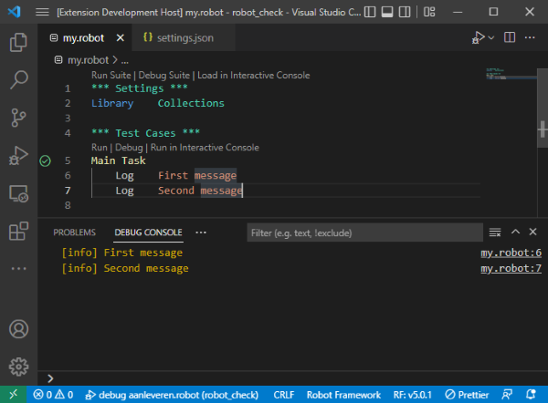

New in 1.7.3 (2022-12-16)
-----------------------------

### Bugfixes

- Debugger: Fixed issue where the stack of the debugger could end up being unsynchronized.
- Don't prefix module name for keywords in the current module. [#843](https://github.com/robocorp/robotframework-lsp/issues/843)

New in 1.7.0 (2022-12-13)
-----------------------------

### New features

- It's possible to make a launch with a target in the arguments by specifying `<target-in-args>` as the target.

### Bugfixes

- Properly collect references for keywords with variables in the name. [#827](https://github.com/robocorp/robotframework-lsp/issues/827)
- Add placeholders when completing keywords with variables in the name. [#824](https://github.com/robocorp/robotframework-lsp/issues/824)
- If there's some error in a debugger callback, don't break execution. [#841](https://github.com/robocorp/robotframework-lsp/issues/841)
- Find references for variables embedded in keywords. [#825](https://github.com/robocorp/robotframework-lsp/issues/825)

New in 1.6.0 (2022-12-03)
-----------------------------

### New features

- `Robot Output` view:

  - Now shows the contents of the current run in real time.
  - Can filter out keywords with `NOT RUN` status.
  - Hides iteration nodes after the 50th iteration (only if marked as `PASS` or `NOT RUN`).
  - Embeds HTML contents from log entries with `html=true`. 

- Code completion is now provided for the library name and resource name.

- New Setting to configure keyword completions:

  - `robot.completions.keywords.prefixImportName`: Define whether completions showing keywords should prefix completions with the import name when applied.
  - `robot.completions.keywords.prefixImportNameIgnore`: Allows defining import names which should not be prefixed for keyword completions. i.e.: `["builtin"]`.

- New Settings to configure completions from keywords *not currently imported* in the current module (a.k.a.: auto-imports):

  - `robot.completions.keywordsNotImported.enable`: Defines whether to show completions for keywords not currently imported (adds the proper import when applied).
  - `robot.completions.keywordsNotImported.addImport`: Defines whether to actually add the import statement when applying completions showing keywords not currently imported.

### Bugfixes

- Colors in the `Interactive Console` could be wrong on some cases.

New in 1.5.0 (2022-11-09)
-----------------------------

### New features

- Quick-fixes especially suited for TDD-style coding lovers:
    - Create Keyword from undefined keyword diagnostic.
    - Create named Keyword argument from named unresolved argument.
    - Create Library from undefined Library import.
    - Create Resource from undefined Resource import.
    - Create Variable file from undefined Variable file import.

- Other quick-fixes:
    - Import resource or library from undefined keyword diagnostic.

### Bugfixes

- Fixed caching issue where adding a file would not invalidate an internal cache which could make resolved imports appear as unresolved.

New in 1.4.3 (2022-11-04)
-----------------------------

### Bugfixes

- `Robot Output` View can deal with `RETURN` properly.

New in 1.4.0 (2022-11-02)
-----------------------------

### New features

- `Robot Output` View
    - Shows information from output.xml when it's selected.
    - Note: currently in beta.

### Bugfixes

- Fixes in `Robot Flow Explorer`.
- Fix issue in test explorer integration when a `.robot` which is not under the workspace is opened.

New in 1.3.5 (2022-10-19)
-----------------------------

### Bugfixes

- If a user is paused in a log message break he should still be able to evaluate keywords based on the previous stack context.
- Right click on folder and selecting `Robot Framework -> Run/Debug Tests/Tasks Suite` properly runs tests again. [#776](https://github.com/robocorp/robotframework-lsp/issues/776)
- In the `interactive console`, if a multi-line statement is entered without a `***` section prefix, properly indent considering new lines.
- Colors in the `interactive console` could be wrong on some cases.
- Restore behavior that showed errors for keyword callers in peek error window (configurable through `robot.run.peekError.showErrorsInCallers`).
- Fixed internal issue in debugger where a `path` variable could be accessed when undefined.

New in 1.3.0 (2022-10-06)
-----------------------------

### New features

- Vendored Robocop updated to 2.5.0.
- Vendored Robotidy updated to 3.2.0.

### Bugfixes

- Get stack location on `Robot Framework 3`. [#774](https://github.com/robocorp/robotframework-lsp/issues/774)
- Properly show errors even if the stack location cannot be found. [#774](https://github.com/robocorp/robotframework-lsp/issues/774)
- Traceback order now matches the same order as Python . [#772](https://github.com/robocorp/robotframework-lsp/issues/772)

New in 1.2.0 (2022-09-28)
-----------------------------

### New features

- The Code Lens `Run/Debug` now launches using the test explorer (so, clicking it or the `Run/Debug` in the gutter is the same thing).
    - A new option: `robot.run.peekError.level` defines up to which level the logs should be shown in the resulting `Peek Error` window.
    - A new option: `robot.run.peekError.showSummary` defines whether a message should be shown at the task/test level with a summary of the errors.
    - Traceback is shown on error in `Peek Error` window.
    
    
    
- Log messages now appear in the `DEBUG CONSOLE` view even when running without debugging.

    
    
- A `ROBOT DOCUMENTATION` view is now available for showing documentation.
    - When the cursor is over a library name, shows the full documentation for that library.
    
    
    
- Flow Explorer now has custom handling for `[Setup]` and `[Teardown]`.

    

New in 1.1.3 (2022-09-14)
-----------------------------

### Bugfixes

- Snippets take into account the value of `robot.completions.keywords.argumentsSeparator`. [#723](https://github.com/robocorp/robotframework-lsp/issues/723)
- Completions properly presented for `Variables` under `*** Settings ***`. [#744](https://github.com/robocorp/robotframework-lsp/issues/744)
- Flow Explorer can now follow keywords defined in other files.

New in 1.1.0 (2022-08-24)
-----------------------------

### New features

- [VSCode] `Robot Flow Visualization`: a new visualization which shows the Robot execution as a graph (currently in the browser).
    - Generated for the tasks/tests in the current file through the command: `Robot Framework: Open Robot Flow Explorer`
- [VSCode] It's now possible to enable `Run/Debug` and `Interactive Console` code-lenses individually.
- Code analysis setting to check if keyword is not used anywhere in the workspace.
    - Opt-in through the `robot.lint.unusedKeyword:true` setting. [#722](https://github.com/robocorp/robotframework-lsp/issues/722)
- An LRU based on file size now prevents unlimited usage of RAM when caching files loaded from the filesystem. [#720](https://github.com/robocorp/robotframework-lsp/issues/720)
    - It's possible to customize the size of the target memory for this LRU through the `RFLS_FILES_TARGET_MEMORY_IN_BYTES` environment variable.
- If a keyword call resolves to multiple keywords, the argument analysis is done for all the matches. [#724](https://github.com/robocorp/robotframework-lsp/issues/724)
- (Experimental) Support for localization in Robot Framework 5.1. [#728](https://github.com/robocorp/robotframework-lsp/issues/728)
    - The language may be set just for a file (with `language: <lang>` on the top of the file).
    - The language may be specified globally through the setting: `robot.language`.
    - Support for completions with translated section names and settings.
    - Support for syntax highlighting translated bdd prefixes.
    - The language(s) set in the `robot.language` configuration are automatically added as parameter on new launches.

### Bugfixes

- [VSCode] A non-string value is converted to string before expanding variables. [#727](https://github.com/robocorp/robotframework-lsp/issues/727)
- Operations no longer timeout, rather, they just print to the log (as the timeouts weren't always ideal for slower machines). [#733](https://github.com/robocorp/robotframework-lsp/issues/733)
- Fixed issue where references wouldn't be found properly.
- Variables imported from module folder (`module/__init__.py`) are properly recognized. [#734](https://github.com/robocorp/robotframework-lsp/issues/734) 

New in 1.0.0 (2022-08-09)
-----------------------------

### New features

- It's possible to manually request linting: [#611](https://github.com/robocorp/robotframework-lsp/issues/611)
    - For all files on the workspace using the command: Robot Framework: Lint all files in the workspace.
    - Given explorer selection (by right-clicking selection in explorer) and selecting Robot Framework > Lint.
- When a keyword call would resolve to more than one keyword definition with the same name an error is reported. [#432](https://github.com/robocorp/robotframework-lsp/issues/432)
- Note: it can be disabled with `"robot.lint.keywordResolvesToMultipleKeywords": false`.
- If a resource/library/variable import is not found and its name has variables, the resolved name is shown.
- Interactive console
    - robot.interactiveConsole.arguments can be used to customize the arguments initializing the interactive console. [#648](https://github.com/robocorp/robotframework-lsp/issues/648)
    - robot.variables defined are now automatically loaded in the interactive console.
    - The default output file generated by the interactive console is now in ${workspace}/interactive_console_output.xml

### Bugfixes

- If the stop button is pressed in a launch, subprocesses are killed regardless of the value of `RFLS_KILL_ZOMBIE_PROCESSES`.
- The default value (which may resolve to a variable) is considered when resolving environment variables. [#715](https://github.com/robocorp/robotframework-lsp/issues/715)
- File system notifications properly track changes to `.yaml` files.[#710](https://github.com/robocorp/robotframework-lsp/issues/710)
- File system notifications properly handle tracking conflicts when a folder is tracked more than once recursively and not recursively in the same subtree. [#710](https://github.com/robocorp/robotframework-lsp/issues/710)
- Variables are properly resolved recursively. [#715](https://github.com/robocorp/robotframework-lsp/issues/715)
- Doc highlight no longer raises error with unclosed variable.
- A library is no longer considered more than once when collecting keywords.

New in 0.49.0 (2022-07-20)
-----------------------------

- VSCode `1.65.0` is now required (to support HTML in markdown contents).
- Zombie processes are no longer automatically killed after doing a Robot Framework launch. [#358](https://github.com/robocorp/robotframework-lsp/issues/358)
  - It's possible to enable the previous behavior by setting an environment variable such as: `RFLS_KILL_ZOMBIE_PROCESSES=1`.
- Fix issue where replacement offset in section completion was wrong. [#700](https://github.com/robocorp/robotframework-lsp/issues/700)
- Properly consider extended part of variables in expressions (fixes issue which could make variable not be resolved). [#702](https://github.com/robocorp/robotframework-lsp/issues/702)
- Resolve variable files imported as modules. [#699](https://github.com/robocorp/robotframework-lsp/issues/699)
- Vendored Robocop upgraded to 2.2.0. [#703](https://github.com/robocorp/robotframework-lsp/issues/703)
- Robocop is always run with the project root as the cwd. [#703](https://github.com/robocorp/robotframework-lsp/issues/703)
- By default Failures/Errors inside a TRY..EXCEPT statement won't suspend execution while debugging. [#698](https://github.com/robocorp/robotframework-lsp/issues/698)
- Variables are loaded from classes in Python files. [#704](https://github.com/robocorp/robotframework-lsp/issues/704)
- Fixes to support Robot Framework 5.1:
  - Deal with `robot.running.builder.testsettings.TestDefaults` renamed to `robot.running.builder.settings.Defaults`.
  - Consider new `TASK_HEADER` in AST.
  - Consider that `KeywordCall` is given instead of `EmptyLine` in invalid assign in keyword.

New in 0.48.2 (2022-06-07)
-----------------------------

- New setting `"robot.completions.keywords.argumentsSeparator"` allows customizing spacing betwen keyword and arguments when auto-completing Keyword with arguments. [#683](https://github.com/robocorp/robotframework-lsp/issues/683)

New in 0.48.0 (2022-05-30)
-----------------------------

- Consider as defined a reference to any variable set as a global variable anywhere on the workspace. [#641](https://github.com/robocorp/robotframework-lsp/issues/641)
- Code analysis for template arguments.
- Arguments aren't added when applying completions for keywords in `[Template]`.
- Fixed integration with `robotframework-tidy` which could make formatting the same code a second time misbehave. [#687](https://github.com/robocorp/robotframework-lsp/issues/687)
- Properly consider that `For each input work item` from `rpaframework` receives a keyword as the first parameter. [#684](https://github.com/robocorp/robotframework-lsp/issues/684)
- Added support for `Import Library` keyword. [#675](https://github.com/robocorp/robotframework-lsp/issues/675)
- Properly support constructs with nested usage of `Run Keyword` inside `Run Keyword`. [#686](https://github.com/robocorp/robotframework-lsp/issues/686)
- Updated `robotframework-tidy` to `2.2.0`.
- Updated `Robocop` to `2.0.2`.
- Implemented expand and shrink selection (use `Shift+Alt+Right` to select outer scope and `Shift+Alt+left` to deselect).
- GitHub CoPilot inline suggestions are applied when tab is activated instead of adding 4-spaces.
- A simpler TextMate grammar is now used to work better with bracket pair colorization (which is enabled by default in VSCode `1.67`).
    - Note that initially very little code will be highlighted until semantic highlighting takes over.

New in 0.47.2 (2022-05-11)
-----------------------------

- Fix issue where a reference could be reported more than once.

New in 0.47.0 (2022-05-11)
-----------------------------

- `Rename` for variables and keywords. [#531](https://github.com/robocorp/robotframework-lsp/issues/531)
- `Find references` for variables (previously references were found only for keywords).
- Information on the Robot Framework version is shown in the bottom bar. [#659](https://github.com/robocorp/robotframework-lsp/issues/659)
- Created `robot.lint.ignoreEnvironmentVariables` setting so that it's possible to ignore environment variables not found. [#663](https://github.com/robocorp/robotframework-lsp/issues/663)
- The `debug console` is no longer opened when making a launch which uses the `terminal`.
- Properly deal with arguments containing regexp matches.
- Environment variables set using `Set Environment Variable` are now recognized.
- Fix issue where variable with a set literal wasn't properly recognized.
- If an argument is specified multiple times a better error message is shown.
- Fix false positive when argument names are specified with variable names in it.
- Consider that an argument default values may be based on a previous argument. [#664](https://github.com/robocorp/robotframework-lsp/issues/664)
- Properly consider local/global context when dealing with variables.
- Properly recognize loop variables in RF 3. [#661](https://github.com/robocorp/robotframework-lsp/issues/661)
- Properly recognize variable that evaluates to 0.
- Properly recognize variables from Python that start with `DICT__` or `LIST__`.
- Fix syntax highlight of inline python evaluation inside of variables in IF statements. [#666](https://github.com/robocorp/robotframework-lsp/issues/666) 
- Properly consider that the `Comment` keyword arguments should be handled as comments. [#665](https://github.com/robocorp/robotframework-lsp/issues/665)

New in 0.46.0 (2022-04-19)
-----------------------------

- Fix position of variable loaded in SetVariable methods to the var name position and not delimiter start.
- If a variable is defined after its usage inside a keyword it's properly marked as undefined.
- Variables in short format in Set XXX Variable keywords are accepted.
- Variables are properly collected from inline if.
- Variables in Evaluate are properly collected.
- Variables from expressions in conditions are properly collected.

New in 0.45.2 (2022-04-14)
-----------------------------

- Bugfix release handling `Wait Until Keyword Succeeds` properly. [#650](https://github.com/robocorp/robotframework-lsp/issues/650)

New in 0.45.0 (2022-04-13)
-----------------------------

- Handle `Run Keywords` properly. [#642](https://github.com/robocorp/robotframework-lsp/issues/642)
- Proper semantic highlighting for `ELSE/ELSE IF` in `Run Keyword If`.
- Proper semantic highlighting for `AND` in `Run Keywords`.
- Hover over arguments from `Run Keyword` targets works properly.
- Properly mark tests passed/failed in test view with `Robot Framework 3.x`. [#644](https://github.com/robocorp/robotframework-lsp/issues/644)
- Fix to `robotframework-tidy` to no longer convert `*Tasks*` to `*Test Cases*`.
- Fix issue in semantic highlighting when a slash was encountered. [#647](https://github.com/robocorp/robotframework-lsp/issues/647)

New in 0.44.0 (2022-04-07)
-----------------------------

- Improvements dealing with **Variables**:
  - Variables in document are considered in Libdoc arguments. [#634](https://github.com/robocorp/robotframework-lsp/issues/634) 
  - Escaping rules are considered when setting variables using `Set Variable XXX` keywords. [#638](https://github.com/robocorp/robotframework-lsp/issues/638) 
  - Variables set with `Set Local Variable` are recognized. [#637](https://github.com/robocorp/robotframework-lsp/issues/637) 
  - Consider that loading an environment variable may have a default value. [#633](https://github.com/robocorp/robotframework-lsp/issues/633) 
  - Variables in python files with annotated assignments are supported (i.e.: `value: int = 10`). [#629](https://github.com/robocorp/robotframework-lsp/issues/629)
  - Variables in templates are not reported as errors. [#632](https://github.com/robocorp/robotframework-lsp/issues/632)
  - Properly deal with variables with other variables inside. [#631](https://github.com/robocorp/robotframework-lsp/issues/631)
  - Load variables from python module with `get_variables` returning a literal dict. [#639](https://github.com/robocorp/robotframework-lsp/issues/639)
- Improvements in debugger:
  - The debugger no longer stops in `Run Keyword And Return Status` by default. [#625](https://github.com/robocorp/robotframework-lsp/issues/625)
  - Assign to variable in debug console repl (i.e.: `${lst}=    Create list    a    b`).
  - Fixed case where breakpoints in `.py` files wouldn't be added. 
- Code-lenses (Run/Debug/Interactive console) are shown by default again.
    - The `robot.codeLens.enable` setting may be used to disable them.
- Upgraded vendored `robocop` to `2.0.1`. 
- Upgraded vendored `robotframework-tidy` to `2.1.0`. 

New in 0.43.2 (2022-03-29)
-----------------------------

- Additional fix in cache invalidation for dependencies. [#617](https://github.com/robocorp/robotframework-lsp/issues/617)

New in 0.43.0 (2022-03-28)
-----------------------------

- Improvements dealing with **Variables**:
    - Undefined variables are now reported. [#334](https://github.com/robocorp/robotframework-lsp/issues/334)
        - `robot.variables`: may be used to specify variables used for launching as well as code-completion/code analysis.
        - `robot.lint.ignoreVariables`: may be used to set variables to be ignored in linting.
        - `robot.loadVariablesFromArgumentsFile` may be used to load variables from an arguments file for code-completion and code analysis.
            - Note: the arguments file still needs to be separately set during launching too.
        - Variables are recognized in expressions as well as inner variables.
    - Variables set with the following keywords are recognized: [#577](https://github.com/robocorp/robotframework-lsp/issues/577)
        - Set Task Variable
        - Set Test Variable
        - Set Suite Variable
        - Set Global Variable
    - Variable files with a `.yml` are properly recognized (previously only `.yaml` was supported). 
    - Semantic highlighting properly deals with advanced variable syntax (with variables inside variables or using a subscript).
    - Variables in assign now have the same color as variables in other places. [#613](https://github.com/robocorp/robotframework-lsp/issues/613)
    - Variable imports which can't be resolved are reported.
        - May be disabled with `robot.lint.undefinedVariableImports`.
- Fix issue in cache invalidation for dependencies. [#617](https://github.com/robocorp/robotframework-lsp/issues/617)
- `\\` is escaped to `\` when passed in the library arguments. [#608](https://github.com/robocorp/robotframework-lsp/issues/608)
- Fix in heuristics to match arguments which could result in wrong argument analysis in keyword calls. [#603](https://github.com/robocorp/robotframework-lsp/issues/603)
- Hover now provides custom hints for variables, imports and parameters.
- Code-lenses are no longer shown by default. [#539](https://github.com/robocorp/robotframework-lsp/issues/539)
    - The `robot.codeLens.enable` setting may be used to re-enable them.

New in 0.42.0 (2022-03-14)
-----------------------------

- Semantic highlighting supports Gherkin style (`Given`, `Then`, ...). [#581](https://github.com/robocorp/robotframework-lsp/issues/581) (patch by @weltings)
- Semantic highlighting only highlights names up to a dot if a related import/resource is found to avoid conflict with Keywords with a dot in the name. [#585](https://github.com/robocorp/robotframework-lsp/issues/585) (patch by @weltings)
- Semantic highlighting available for variables in keyword calls. [#586](https://github.com/robocorp/robotframework-lsp/issues/586)
- Semantic highlighting for `WHILE limit=` and `EXCEPT type=`.
- Report unresolved variables when resolving a resource/import. [#600](https://github.com/robocorp/robotframework-lsp/issues/600) 
- Performance improvements
  - Don't index everything in AST when only items from the section (LibraryImport, ResourceImport, ...) are requested.
  - Caching of dependencies.
- `Run Keyword If` is now properly handled across all features in the language server. [#495](https://github.com/robocorp/robotframework-lsp/issues/495)
- `None` is no longer reported as undefined keyword when used as keyword call. [#597](https://github.com/robocorp/robotframework-lsp/issues/597)
- Misleading message saying that RF is old when it's not installed is no longer shown.
- Environment of Robot where the last action was done is considered for Workspace symbols (when used with Robocorp Robots).
- Pre-releases now available from VSCode marketplace.

New in 0.41.0 (2022-02-22)
-----------------------------

- Argument analysis is now also done for `Run Keyword` variants. [#572](https://github.com/robocorp/robotframework-lsp/issues/572)
- [Debugger] It's now possible to ignore failures inside some keywords so that the debugger doesn't break in these cases when `Robot Log FAIL` is enabled. [#575](https://github.com/robocorp/robotframework-lsp/issues/575)
  - Customizable through the `RFLS_IGNORE_FAILURES_IN_KEYWORDS` and `RFLS_IGNORE_FAILURES_IN_KEYWORDS_OVERRIDE` environment variables (see [Config](https://github.com/robocorp/robotframework-lsp/blob/master/robotframework-ls/docs/config.md#environment-variables) for details).
- Robot icon is now available for the language.
- Performance improvements
  - Improved AST indexing.
  - Notification that settings changed are only sent to the server api if they actually changed.
  - Documentation is now lazily loaded during code-completion.
- Interactive console: snippet mode is exited when a line is evaluated. [#570](https://github.com/robocorp/robotframework-lsp/issues/570)
- References are found when find references is activated from the keyword definition. [#576](https://github.com/robocorp/robotframework-lsp/issues/576)
- Semantic highlighting for Keywords with dotted access improved.
- The documentation conversion from `REST` and `ROBOT` to `markdown` is now done internally. 

New in 0.40.1 (2022-02-12)
-----------------------------

- Critical fix: skip analysis of arguments for `Run Keyword` variants.

New in 0.40.0 (2022-02-12)
-----------------------------

- Keyword calls and library inits are now validated according to the signature. [#558](https://github.com/robocorp/robotframework-lsp/issues/558)
- Usage of deprecated keywords is marked with a strikethrough.
- When a libspec can't be generated the reason and possible fixes are properly shown to the user.
- Signature info is now shown for libraries.
- Added options related to enabling/disabling linting features individually (see: `robot.lint.*` settings).
- Added `${EMPTY}` completion. [#566](https://github.com/robocorp/robotframework-lsp/issues/566)
- Snippet completions are now done at the target `robot.python.executable` and not `robot.language-server.python` (to account for statements only available depending on robot version).
- The active parameter is properly highlighted in the signature help.
- The signature help is shown whenever a space is typed.
- Fixed case where `try..finally` wasn't stepping properly with step next.
- When debugging variable values are shown on hover. [#550](https://github.com/robocorp/robotframework-lsp/issues/550)
- A better error message is provided in the case where `robot` is not available or shadowed. [#563](https://github.com/robocorp/robotframework-lsp/issues/563)
- Semantic highlighting is provided for variables in documentation. [#564](https://github.com/robocorp/robotframework-lsp/issues/564)
- The current argument is highlighted during hover.

New in 0.39.0 (2022-02-03)
-----------------------------

- Robot Framework 5 is now officially supported.
  - New statements (TRY, WHILE) should now work for all existing features.
- Debugger: step next considers that control flow statements are a part of the current keyword.
- Debugger: Fixed issue initializing `pydevd` debugger when it's already present in the environment.
- Semantic highlighting properly colors keyword calls with a namespace in fixtures. [#533](https://github.com/robocorp/robotframework-lsp/issues/533)
- Libraries without keywords (a.k.a `DataDriver`) are no longer considered undefined. [#559](https://github.com/robocorp/robotframework-lsp/issues/559)
- Properly deal with suites with a `__` prefix when launching. [#561](https://github.com/robocorp/robotframework-lsp/issues/561)
- Raised time to obtain libspec mutex and give a better message on failure. [#555](https://github.com/robocorp/robotframework-lsp/issues/555)
- Properly dealing with multi-argument python executable from `ms-python` extension. [#560](https://github.com/robocorp/robotframework-lsp/issues/560)

New in 0.38.1 (2022-01-27)
-----------------------------

- Critical bugfix: it's possible to run test names containing unicode characters again.

New in 0.38.0 (2022-01-26)
-----------------------------

- It's now possible to break when an error or failure is logged (enable in the `BREAKPOINTS` tab). [#284](https://github.com/robocorp/robotframework-lsp/issues/284)
- When launching, better heuristics are used to create a proper test suite. [#482](https://github.com/robocorp/robotframework-lsp/issues/482)
  - A suite is created considering `__init__.robot` in parents based on the specified `target`.
  - By default the `target` will be used to compute the suite as well as the needed filtering.
  - It's possible to specify a `suiteTarget` in the launch now to force a given suite to be created (the `target` is still used for filtering afterwards). 
- When hovering for go to definition the origin location properly highlights the whole region not just the current word.  [#279](https://github.com/robocorp/robotframework-lsp/issues/279)
- Document highlighting is now provided for keywords and variables.
- MarkupContent is now properly used in the signature help.
- Go to definition now works properly with .yaml files.
- The signature part of a keyword is now bold in the documentation.
- Auto-completing in interactive console no longer shows the same reloaded keyword multiple times. [#510](https://github.com/robocorp/robotframework-lsp/issues/510)
- The interactive console now always uses the .robot parsing (which allows test-cases) even when started from a .resource. [#545](https://github.com/robocorp/robotframework-lsp/issues/545)
- The ms-python extension interpreter is used as a fallback if one has not been configured for the language server.
- Keyword namespace access now has a different color in semantic highlighting. [#533](https://github.com/robocorp/robotframework-lsp/issues/533)

New in 0.37.0 (2022-01-19)
-----------------------------

- Code analysis will now notify if Library or Resource cannot be resolved. [#542](https://github.com/robocorp/robotframework-lsp/issues/542)
- If Run Keyword has a variable concatenated, it's no longer considered an error. [#534](https://github.com/robocorp/robotframework-lsp/issues/534)
- Properly resolve variables in arguments in the libspec generation. [#535](https://github.com/robocorp/robotframework-lsp/issues/535)
- Improvements related to scheduling the lint after changing the editor.

New in 0.36.0 (2022-01-17)
-----------------------------

- Support for the VSCode `Test Explorer`:
  - Run/debug tests from an icon in the editor gutter.
  - A custom view the test results is shown.
  - Makes it possible to run only failed tests and filter tests to execute in the UI.
  - See: [https://code.visualstudio.com/docs/python/testing](https://code.visualstudio.com/docs/python/testing) for docs on how to use it.
  - Note: the Run/Debug using code lens is still kept, but it may be removed in the future (based on user feedback).

- Fixed an issue which could make file system change notifications be ignored.
- The extension now runs with `-v` by default (to show info level messages on `OUTPUT > Robot Framework`).
- Fixed issue starting the extension when python wasn't found at the PATH and it was requested from the user.

New in 0.35.0 (2021-12-22)
-----------------------------

- Find references is now implemented. [#396](https://github.com/robocorp/robotframework-lsp/issues/396)
- Chars are now properly escaped when setting environment variables during launching. [#528](https://github.com/robocorp/robotframework-lsp/issues/528)
- On Robot Framework 5, the builtin tidy is no longer available, so, the new robotidy is used automatically.                                  
- The minimum VSCode version is now 1.61.0

New in 0.34.0 (2021-12-16)
-----------------------------

- Created an action to stop the language server, clear caches and restart the language server. [#498](https://github.com/robocorp/robotframework-lsp/issues/498)

- WorkspaceFolder is properly passed as a scope when reading launch configurations. [#526](https://github.com/robocorp/robotframework-lsp/issues/526)
  i.e.: If the code-lens template wasn't being found in `0.33.0`, this should be fixed in `0.34.0`.

- The Robot Framework Language Server is now automatically restarted if some configuration related to starting it is changed.
  i.e.: 
  - `"robot.language-server.python"`
  - `"robot.language-server.tcp-port"`
  - `"robot.language-server.args"`

New in 0.33.0 (2021-12-14)
-----------------------------

- PYTHONPATH entries passed as -P to libdoc are now normalized (fixes issues passing entries which could end with `/.`).

- Code-lens launch templates may be specified through a `launch` configuration in the settings.

New in 0.32.0 (2021-12-05)
-----------------------------

- Updated Robocop to 1.12.0 and vendored a TOML implementation.

New in 0.31.0 (2021-12-01)
-----------------------------

- Properly use `MarkupContent` for `CompletionItem.documentation`.
- A libspec format of `"markdown"` is supported as documentation format.

New in 0.30.0 (2021-12-01)
-----------------------------

- Library arguments can now be used in the libspec generation. Patch by `Jozef Grajciar`. [#343](https://github.com/robocorp/robotframework-lsp/issues/343) 
  - `robot.libraries.libdoc.needsArgs` setting can be used to specify which libraries require arguments in the generation.
  - `Remote` and `FakerLib` are set by default.
- Libspec files may be pre-generated. [#163](https://github.com/robocorp/robotframework-lsp/issues/163)
  - `robot.libraries.libdoc.preGenerate` may be used to specify which libraries to pre-generate.
  - Some heuristics cover a few libraries which are always pre-generated if installed.
- Fixes related to aliasing libraries. [#397](https://github.com/robocorp/robotframework-lsp/issues/397)
- Documentation is shown for keywords still not imported. [#516](https://github.com/robocorp/robotframework-lsp/issues/516)
- Module is shown for for keywords already imported. [#507](https://github.com/robocorp/robotframework-lsp/issues/507)

New in 0.29.0 (2021-11-16)
-----------------------------

- Fixed error on dictionary completions. [#503](https://github.com/robocorp/robotframework-lsp/issues/503)
- Renamed code lens to `Load in Interactive Console` for non `Test`/`Task` sections. [#502](https://github.com/robocorp/robotframework-lsp/issues/502)
- It's now possible to redefine user keywords in the Interactive Console. [#502](https://github.com/robocorp/robotframework-lsp/issues/502)

New in 0.28.0 (2021-11-08)
-----------------------------

- When a command line is too big to be launched in the terminal, a wrapper script is used [#394](https://github.com/robocorp/robotframework-lsp/issues/394)
- The default is now launching in the terminal and not in the debug console.

New in 0.27.0 (2021-11-01)
-----------------------------

- Fixed regression concatenating args of code lens launch. [#487](https://github.com/robocorp/robotframework-lsp/issues/487)

New in 0.26.0 (2021-11-01)
-----------------------------

- Consider `PYTHONPATH` when searching for `Resource` imports. [#486](https://github.com/robocorp/robotframework-lsp/issues/486)
- Load all fields from `'Robot Framework: Launch template'` for code lens execution. [#447](https://github.com/robocorp/robotframework-lsp/issues/447)
- Properly consider that `[Template]` has a Keyword target. [#479](https://github.com/robocorp/robotframework-lsp/issues/479)
- Mark `robot.codeFormatter` as a string and not an array. [#481](https://github.com/robocorp/robotframework-lsp/issues/481)

New in 0.25.0 (2021-10-21)
-----------------------------

- The `robotframework-tidy` code formatter is integrated.
  - Note: `"robot.codeFormatter": "robotidy"` must be set in the settings to use it.
- The `CURDIR` variable is properly resolved. [#449](https://github.com/robocorp/robotframework-lsp/issues/449)
- If `robot.pythonpath` is set, it's used in the PYTHONPATH for the interactive console. [#475](https://github.com/robocorp/robotframework-lsp/issues/475)
- The debugger now bundles the latest version of `pydevd` for Python debugging.
- `Thread.daemon` attribute is used instead of `Thread.setDaemon`. [#477](https://github.com/robocorp/robotframework-lsp/issues/477)
- Bundled `Robocop` updated `1.11.2`.

New in 0.24.0 (2021-10-13)
-----------------------------

- Variable in run keyword argument should not be considered error. [#468](https://github.com/robocorp/robotframework-lsp/issues/468)
- If a launch is invalid, show actual error and don't try to connect to `pydevd`. [#433](https://github.com/robocorp/robotframework-lsp/issues/433)
- Give proper error message when launching if `cwd` doesn't exist.
- Ignore connection errors when connection is dropped in debugger.
- Fixed crash during startup: Improving port collection from Remote FS Observer. [#434](https://github.com/robocorp/robotframework-lsp/issues/434)

New in 0.23.2 (2021-09-22)
-----------------------------

- Fixed issue launching when no environment is provided.

New in 0.23.1 (2021-09-21)
-----------------------------

- Fixed issue specifying files to be tracked in the filesystem observer. [#450](https://github.com/robocorp/robotframework-lsp/issues/450)

New in 0.23.0 (2021-09-20)
-----------------------------

- Interactive Console
  - The `Scratchpad` was renamed to `Interactive Console`.
  - It should be easier to distinguish between input and output.
  - Errors are collapsed by default and it's possible to expand to see the full traceback.
  - When using code lens multiple whitespace lines in the end of a block is not sent to the Interactive Console.
  - An introductory text is shown with more information on how to use the Interactive Console.

New in 0.22.0 (2021-09-06)
-----------------------------

- Fix error computing code-lens with comment inside test. [#438](https://github.com/robocorp/robotframework-lsp/issues/438)
- Recognize keywords when used as arguments of other keywords (for BuiltIn library). [#291](https://github.com/robocorp/robotframework-lsp/issues/291)

New in 0.21.0 (2021-08-18)
-----------------------------

- Find definition properly works for dictionary variables. Fix by: Marduk Bolaños. [#407](https://github.com/robocorp/robotframework-lsp/issues/407)
- Complete dictionary items when the variable name includes spaces. Fix by: Marduk Bolaños.

New in 0.20.0 (2021-07-29)
-----------------------------

- ${workspaceFolder} is accepted when resolving variables. 
- ${env:VAR_NAME} is accepted when resolving variables.
- Robocop updated to 1.8.1.
- When using the poll mode for tracking file changes, it's possible to ignore directories. [#398](https://github.com/robocorp/robotframework-lsp/issues/398)
- dict(&)/list(@) variables can be referenced as regular ($) variables. [#387](https://github.com/robocorp/robotframework-lsp/issues/387)
- Completion for dictionary items with subscript. Fix by: Marduk Bolaños. [#301](https://github.com/robocorp/robotframework-lsp/issues/301) 
- Completion for dictionary variable names. Fix by: Marduk Bolaños. [#301](https://github.com/robocorp/robotframework-lsp/issues/301)

New in 0.19.0 (2021-07-14)
-----------------------------

Scratchpad (REPL for `Robot Framework`) available for VSCode.

See the [related FAQ](https://github.com/robocorp/robotframework-lsp/blob/master/robotframework-ls/docs/faq.md#how-to-use-the-scratchpad) for details.

New in 0.18.0 (2021-06-02)
-----------------------------

- Support for variables import:
  - Loads variables from `.py` and `.yaml` files.
- Semantic highlighting: equals sign no longer causes incorrect coloring on `catenate` keyword and `documentation` section.
- A module shadowing `builtin.py` no longer causes the default `Builtin` module not to be found anymore.
- Code analysis no longer throws error when dealing with a `Library` without a name declared. 
- Robocop updated to 1.7.1.

New in 0.17.0 (2021-05-24)
-----------------------------

- Variables may be used in settings. See the [related FAQ](https://github.com/robocorp/robotframework-lsp/blob/master/robotframework-ls/docs/faq.md#how-to-use-variables-in-settings) for details.
- Semantic highlighting was improved to differentiate the parameter (name) from the argument (value).
- Code-lens to run/debug suite is only shown if there are actually tests in the suite.
- Breakpoint improvements (condition, hitCondition, logMessage).
- Variables are now shown in the document outline.
- When launching a `.robot`, if a `__init__.robot` is present in the same directory, a `--suite` is done by default.
- Breakpoints are properly hit on `__init__.robot` files.
- Fixed issue which could lead to high-cpu due to filesystem polling.
  - It's now possible to set an environment variable `ROBOTFRAMEWORK_LS_POLL_TIME=<poll time in seconds>` to change the filesystem target poll time.
  - When possible, it's recommended to set an environment variable `ROBOTFRAMEWORK_LS_WATCH_IMPL=watchdog` to use native watches on Linux and MacOS (already default on Windows).
  - A file-observer is started as a separate process and multiple clients communicate with it.
  
 
New in 0.16.0 (2021-05-12)
-----------------------------

- Document symbols.
- It's possible to configure the casing of keywords from libraries used in code-completion.
- Launching/debugging improvements (VSCode):
  - Code lens with options to run/debug a test, task or suite.
  - Commands to run/debug a test, task or suite
  - Note: it's possible to configure the command/code lens launch by having a `Robot Framework: Launch template` launch config.
  - When a run is done in the internal terminal, provide hyperlinks to open html results in the browser.

New in 0.15.0 (2021-05-05)
-----------------------------

- Mixed-mode debugging:
  - Add line breakpoints in `.robot` or `.py` files.

New in 0.14.0 (2021-04-14)
-----------------------------

- Robocop linter is now opt-in instead of opt-out. [#312](https://github.com/robocorp/robotframework-lsp/issues/312)
- Add code-completion for `${CURDIR}`. [#313](https://github.com/robocorp/robotframework-lsp/issues/313)
- Use listener instead of monkey-patching when debugging (RF 4 onwards). [#310](https://github.com/robocorp/robotframework-lsp/issues/310)
- Silence exception from creating libspec for Dialogs module. [#93](https://github.com/robocorp/robotframework-lsp/issues/93)
- Search `PYTHONPATH` when looking to resolve relative paths in Imports. [#266](https://github.com/robocorp/robotframework-lsp/issues/266)

New in 0.13.1 (2021-04-08)
-----------------------------

- Resolve environment variables when trying to resolve libraries/resources paths (i.e.: `%{env_var}`). [#295](https://github.com/robocorp/robotframework-lsp/issues/295)
- Properly resolve variables for Library imports (not only Resource imports).

New in 0.12.0 (2021-04-01)
-----------------------------

- By default, fsnotify (polling) is now used on Linux and Mac and watchdog (native) on Windows due to resource usage limits on Linux and Mac.
  Using `watchdog` is still recommended when possible. See the [FAQ](https://github.com/robocorp/robotframework-lsp/blob/master/robotframework-ls/docs/faq.md#how-to-change-the-file-watch-mode)
  for details. 
- Code-folding is now available. [#288](https://github.com/robocorp/robotframework-lsp/issues/288)
- Hovering over keywords now shows its information.
- Code analysis with empty teardown works properly. [#289](https://github.com/robocorp/robotframework-lsp/issues/289)
- No longer recursing on local circular imports. [#269](https://github.com/robocorp/robotframework-lsp/issues/269)
- System directory separator `${/}` is recognized. [#153](https://github.com/robocorp/robotframework-lsp/issues/153)
- It's now possible to enable logging through a `ROBOTFRAMEWORK_LS_LOG_FILE` environment variable.
- [Robocop](https://robocop.readthedocs.io/en/latest/) fixes integrated (trailing blank line, misaligned variable).

New in 0.11.1 (2021-03-29)
-----------------------------

- [Robocop](https://robocop.readthedocs.io/en/latest/) updated to 1.6.1.
- Fixes in semantic syntax hightlighting with Robot Framework 3.x.
- Keywords from `Reserved.py` are no longer shown for auto-import.

New in 0.11.0 (2021-03-24)
-----------------------------

- [Robocop](https://robocop.readthedocs.io/en/latest/) is now used to lint (enabled by default, can be disabled in settings).
- Snippets completion is now properly case-insensitive.
- If there's some problem computing semantic tokens, log it and still return a valid value. [#274](https://github.com/robocorp/robotframework-lsp/issues/274)
- If a keyword name is defined in the context, don't try to create an auto-import for it.
- Reworded some settings to be clearer.

New in 0.10.0 (2021-03-19)
-----------------------------

- Fixed issue changing workspace folders.
- Added templates for `IF` statements.
- `FOR` templates no longer have a `/` in them.
- Added support for `semanticTokens/full` in the language server.
- Minimum VSCode version required is now `1.53.0`.

New in 0.9.1 (2021-03-10)
-----------------------------

- Support python packages as libraries (`package/__init__.py`). [#228](https://github.com/robocorp/robotframework-lsp/issues/228)

New in 0.9.0 (2021-03-03)
-----------------------------

- It's now possible to use polling instead of native filesystem notifications
  - It may be useful in case watchdog is having glitches.
  - To use it, set an environment variable: `ROBOTFRAMEWORK_LS_WATCH_IMPL=fsnotify`
- Gathering workspace symbols is much faster.
- Keyword completions should not be duplicated by the auto-import Keyword completions anymore. 

New in 0.8.0 (2021-02-16)
-----------------------------

- New setting: robot.workspaceSymbolsOnlyForOpenDocs for cases where code-completion is slow due to workspace symbols scanning. [#243](https://github.com/robocorp/robotframework-lsp/issues/243) 
- Don't offer completions for section names after 2 spaces of the section name.
- Debugger is working with the latest Robot Framework master.

New in 0.7.1 (2021-01-13)
-----------------------------

- Support for If/For statements in debugger with the master version of RobotFramework. [#232](https://github.com/robocorp/robotframework-lsp/issues/232)
- Properly handling case where parsing raised an Exception which could break code-completion and workspace symbols. [#231](https://github.com/robocorp/robotframework-lsp/issues/231)

New in 0.7.0 (2021-01-07)
-----------------------------

- Code completion for all keywords in the workspace with auto-import of Library or Resource. [#210](https://github.com/robocorp/robotframework-lsp/issues/210)
- When a space is at the end of a line when requesting a code-completion it's properly recognized as a part of the keyword.

New in 0.6.4 (2020-12-21)
-----------------------------

- When launching the language server, pick the version shipped and not the one installed in the target python [#91](https://github.com/robocorp/robotframework-lsp/issues/91)

New in 0.6.3 (2020-12-08)
-----------------------------

- watchdog binary dependencies are shipped along in Mac OS [#190](https://github.com/robocorp/robotframework-lsp/issues/190)

New in 0.6.2 (2020-12-02)
-----------------------------

- If libspec cannot be generated because docutils is not installed, force text mode. [#199](https://github.com/robocorp/robotframework-lsp/issues/199)
- Support libraries with the same basename but in different places. [#204](https://github.com/robocorp/robotframework-lsp/issues/204)

New in 0.6.1 (2020-11-29)
-----------------------------

- Performance improvement: Cache that libspec could not be created.

New in 0.6.0 (2020-11-25)
-----------------------------

- Support new error syntax reporting (from Robot Framework 4.0)
- Support for browsing workspace symbols (`Ctrl+T`)

New in 0.5.0 (2020-10-26)
-----------------------------

- Support new libdoc format (from Robot Framework 4.0)

New in 0.4.3 (2020-10-12)
-----------------------------

- Updated icon

New in 0.4.2 (2020-09-29)
-----------------------------

- insertText attribute value is now also assigned for CompletionItem. [#158](https://github.com/robocorp/robotframework-lsp/issues/158)
- The environment for an interpreter contributed by some extension is properly used. [#159](https://github.com/robocorp/robotframework-lsp/issues/159)

New in 0.4.1 (2020-09-28)
-----------------------------

- Fixed startup concurrency issue setting up plugin dir contributed by other extensions. [#155](https://github.com/robocorp/robotframework-lsp/issues/155)

New in 0.4.0 (2020-09-22)
-----------------------------

- Default parameters are no longer shown by default in code-completion. [#138](https://github.com/robocorp/robotframework-lsp/issues/138)
- Code completion for individual Keyword arguments is now available. [#107](https://github.com/robocorp/robotframework-lsp/issues/107)
- Signature help is now available for keyword calls (i.e.: textDocument/signatureHelp) -- activated through `Ctrl+Shift+Space` in VSCode. [#139](https://github.com/robocorp/robotframework-lsp/issues/139)
- Importing a python library with capital letters now works. [#143](https://github.com/robocorp/robotframework-lsp/issues/143)
- Verify whitespace changes in the libspec attribute format. [#150](https://github.com/robocorp/robotframework-lsp/issues/150)
- Renamed from robocorptech to robocorp as the publisher on the VSCode Marketplace. [#137](https://github.com/robocorp/robotframework-lsp/issues/137)
- All requests (except document-change related requests) are now asynchronous. [#141](https://github.com/robocorp/robotframework-lsp/issues/141)
- It's now possible to cancel a request in the language server. [#140](https://github.com/robocorp/robotframework-lsp/issues/140)

New in 0.3.2 (2020-09-02)
-----------------------------

- Support for plugins to allow other extensions to hook different python interpreters for different files.
- Provided --version option to command line to just print the version and exit. [#131](https://github.com/robocorp/robotframework-lsp/issues/131)
- Fix handling changes in folders tracked in a workspace.

New in 0.3.1 (2020-07-27)
-----------------------------

- Debugger: support for evaluate request. [#82](https://github.com/robocorp/robotframework-lsp/issues/82)
- Debugger: builtin variables have their own group. [#106](https://github.com/robocorp/robotframework-lsp/issues/106)
- Python 2 support dropped (Python 3.7+ is now required). [#119](https://github.com/robocorp/robotframework-lsp/issues/119)
- Fixed issue normalizing a name according to Robot Framework rules (so that definition is properly found). [#121](https://github.com/robocorp/robotframework-lsp/issues/121)

New in 0.3.0 (2020-07-01)
-----------------------------

- Go to definition for variables.
- Code completion for `Resource Imports` and `Library Imports`.
- Go to definition support for `Resource Imports` and `Library Imports`.
- Do code analysis in a separate process (i.e.: code-completion should not wait for code analysis).
- Create cached document from filesystem (i.e.: ast is not recreated unless `.robot` file is changed).
- Check spaces and unicode characters on pythonpath/resources/imports.
- Config link in the vs code extension documentation is broken.

New in 0.2.3 (2020-06-16)
-----------------------------

- Variables: Code-completion for builtin variables.
- When a user library (.py) changes the related auto-generated spec is automatically updated.
- If `robot.python.executable` is set, it's used to launch the debugger.
- Debugger: step return implementation added.
- Properly Search for python and python3 on the PATH on Linux and Mac.

New in 0.2.2 (2020-06-09)
-----------------------------

- `robot.pythonpath` setting automatically passed as `--pythonpath` argument when launching.
- `robot.pythonpath` setting now used to locate resources and libraries for when resolving keywords. [#79](https://github.com/robocorp/robotframework-lsp/issues/79)
- `robot.variables` setting automatically passed as `--variable` argument when launching. 
- `robot.variables` setting is now used in code completion for variables. [#21](https://github.com/robocorp/robotframework-lsp/issues/21)
- Arguments shown in code completion when creating a Keyword. [#21](https://github.com/robocorp/robotframework-lsp/issues/21)
- Support for Library Import with `WITH NAME` syntax. [#64](https://github.com/robocorp/robotframework-lsp/issues/64)
- Typing info removed when completing keywords. [#89](https://github.com/robocorp/robotframework-lsp/issues/89)

New in 0.2.1 (2020-06-04)
-----------------------------

Critical bugfix to support the debugger with Setup/Teardown. [#85](https://github.com/robocorp/robotframework-lsp/issues/85)

New in 0.2.0 (2020-06-03)
-----------------------------

- Preliminary support for debugging. [#30](https://github.com/robocorp/robotframework-lsp/issues/30)
    - Note: this is an initial release for the feature and should be considered beta (please test and report any issues found).
    - The current functionalities include:
        - Add line breakpoints
        - Pause at breakpoints to inspect the stack and see variables
        - Step in
        - Step over
        - Continue
- Handling `text` only parameter in `textDocument/didChange`. [#78](https://github.com/robocorp/robotframework-lsp/issues/78)
- Updated VSCode client dependency versions. [#65](https://github.com/robocorp/robotframework-lsp/issues/65)
- Snippets code-completion for some constructs (`For In`, `Run Keyword If`). [#69](https://github.com/robocorp/robotframework-lsp/issues/69)

New in 0.1.1 (2020-05-11)
-----------------------------

- Variables code completion is provided for variables assigned to keyword return values. [#21](https://github.com/robocorp/robotframework-lsp/issues/21)
- Variables properly tokenized when completing for variables. [#21](https://github.com/robocorp/robotframework-lsp/issues/21)
- Show argument names in code completion. Fixes [#53](https://github.com/robocorp/robotframework-lsp/issues/53)
- No longer giving error if specified resource points to a directory. Fixes [#63](https://github.com/robocorp/robotframework-lsp/issues/63)
- `tab` now properly applies completions. [#52](https://github.com/robocorp/robotframework-lsp/issues/52)

New in 0.1.0 (2020-05-05)
-----------------------------

- Preliminary code completion support for variables defined in [Variable Tables](https://robotframework.org/robotframework/latest/RobotFrameworkUserGuide.html#variable-table).
- Support for keywords defined with a library prefix  [#58](https://github.com/robocorp/robotframework-lsp/issues/58).
- Support for keywords with embededd arguments  [#59](https://github.com/robocorp/robotframework-lsp/issues/59).
- Support for keywords with Gherkin syntax (i.e.: given, when, then, etc) [#59](https://github.com/robocorp/robotframework-lsp/issues/59).

New in 0.0.10 (2020-04-28)
-----------------------------

- Code analysis: check if keywords are properly imported/defined (new in 0.0.10).
- Properly consider that keywords may appear in fixtures and templates (code analysis, code completion and go to definition).
- Add `args` placeholder to Robot launch configuration file (launching).
- Arguments are now shown in keyword documentation (code completion).
- Properly deal with path based library imports (code analysis, code completion and go to definition).

New in 0.0.9 (2020-04-20)
-----------------------------

- Go to definition implemented for keywords.
- Only environment variables set by the user when launching are passed when launching in integrated terminal.
- `~` is properly expanded when it's specified in the logging file.

New in 0.0.8 (2020-04-14)
-----------------------------

- Launch robotframework directly from VSCode (note: right now debugging is still not supported 
  -- a debug run will do a regular launch). Fixes [#29](https://github.com/robocorp/robotframework-lsp/issues/29)
- A setting to complete section headers only in the plural/singular form is now available (`robot.completions.section_headers.form`). Fixes [#42](https://github.com/robocorp/robotframework-lsp/issues/42)
- Improvements in syntax highlighting

New in 0.0.7 (2020-04-04)
-----------------------------

- Return empty list when code formatter has no changes. Fixes [#35](https://github.com/robocorp/robotframework-lsp/issues/35)
- Don't show keywords twice. Fixes [#34](https://github.com/robocorp/robotframework-lsp/issues/34)
- Improvements in syntax highlighting

New in 0.0.6 (2020-04-02)
-----------------------------

- Provide source code formatting with the Tidy builtin tool. Fixes [#26](https://github.com/robocorp/robotframework-lsp/issues/26)
- Fix for incomplete json message ([#33](https://github.com/robocorp/robotframework-lsp/issues/33)) and parsing of .resource ([#32](https://github.com/robocorp/robotframework-lsp/issues/32))

New in 0.0.5 (2020-03-30)
-----------------------------

- Add icon to extension. Fixes [#22](https://github.com/robocorp/robotframework-lsp/issues/22)
- Code completion for keywords.
- License is now Apache 2.0. Fixes [#24](https://github.com/robocorp/robotframework-lsp/issues/24)

New in 0.0.4 (2020-03-05)
-----------------------------

- Code completion for section internal names

New in 0.0.3 (2020-02-11)
-----------------------------

- Code completion for section headers

New in 0.0.2 (2020-02-09)
-----------------------------

- Various internal improvementss

New in 0.0.1 (2020-01-31)
-----------------------------

- Basic syntax highlighting
- Syntax validation